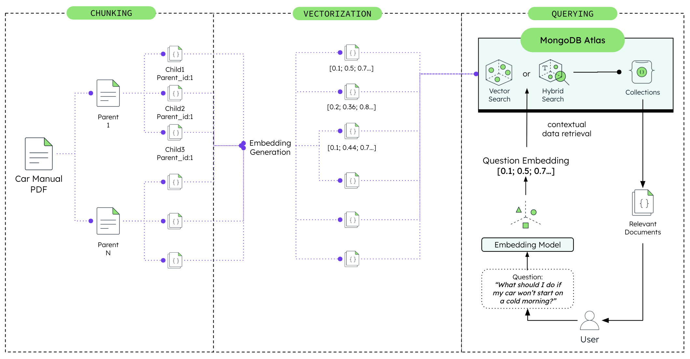

# Car Manual Explorer - MongoDB-Powered Technical Explorer Documentation System


In today's complex automotive landscape, technicians and vehicle owners need instant access to accurate technical information. Traditional PDF manuals are cumbersome to navigate, making it difficult to find specific procedures, safety warnings, or troubleshooting steps quickly. Solutions such as semantic search, AI-powered Q&A, and intelligent document chunking can transform how your organization accesses and utilizes technical documentation. Additionally, with features like vector-based similarity search, hybrid search combining multiple approaches, and context-aware retrieval, our system ensures you find the exact information you need, when you need it.

By the end of this guide, you'll have a comprehensive car manual exploration system up and running capable of all the solutions mentioned above.

We will walk you through the process of configuring and using [MongoDB Atlas](https://www.mongodb.com/atlas) as your backend with [Google Vertex AI](https://cloud.google.com/vertex-ai) for MongoDB-powered search and question answering in your [Next.js](https://nextjs.org/) and [FastAPI](https://fastapi.tiangolo.com/) application.

The architecture we're about to set up is depicted in the diagram below:



If you want to learn more about Retrieval-Augmented Generation (RAG) and semantic search for technical documentation, visit the following pages:

- [MongoDB Atlas Vector Search](https://www.mongodb.com/docs/atlas/atlas-search/vector-search/)
- [AWS Bedrock Foundation Models](https://aws.amazon.com/bedrock/foundation-models/)
- [Google Vertex AI](https://cloud.google.com/vertex-ai/docs/generative-ai/learn/overview)
- [Building RAG Applications with MongoDB](https://www.mongodb.com/developer/products/atlas/building-rag-application-mongodb-atlas/)

Let's get started!

## Prerequisites

Before you begin working with this project, ensure that you have the following prerequisites set up in your development environment:

- **Python 3.10**: The backend of this project is built with Python 3.10 specifically. You can download it from the [official website](https://www.python.org/downloads/).

- **Node.js 18+**: The frontend requires Node.js 18 or higher, which includes npm for package management. You can download it from the [official Node.js website](https://nodejs.org/).

- **Poetry**: The backend uses Poetry for dependency management. Install it by following the instructions on the [Poetry website](https://python-poetry.org/docs/#installation).

- **MongoDB Atlas Account (8.1+)**: This project uses MongoDB Atlas for data storage and hybrid search capabilities with native $rankFusion. **MongoDB 8.1 or higher is required** for the $rankFusion aggregation stage. If you don't have an account, you can sign up for free at [MongoDB Atlas](https://www.mongodb.com/cloud/atlas/register). Once you have an account, follow these steps to set up a minimum free tier cluster:

  - Log in to your MongoDB Atlas account.
  - Create a new project or use an existing one, and then click "create a new database".
  - Choose the free tier option (M0).
  - Configure the cluster settings according to your preferences and then click "finish and close" on the bottom right.
  - Finally, add your IP to the network access list so you can access your cluster remotely.

- **Docker (Optional)**: For containerized deployment, Docker is required. Install it from the [Docker website](https://www.docker.com/get-started).

## Initial Configuration

### Obtain your MongoDB Connection String

Once the MongoDB Atlas Cluster is set up, locate your newly created cluster, click the "Connect" button and select the "Connect your application" section. Copy the provided connection string. It should resemble something like this:

```
mongodb+srv://<username>:<password>@cluster-name.xxxxx.mongodb.net/
```

> [!Note]
> You will need the connection string to set up your environment variables later (`MONGODB_URI`).

### Cloning the Github Repository

Now it's time to clone the Car Manual Explorer source code from GitHub to your local machine:

1. Open your terminal or command prompt.

2. Navigate to your preferred directory where you want to store the project using the `cd` command. For example:

   ```bash
   cd /path/to/your/desired/directory
   ```

3. Once you're in the desired directory, use the `git clone` command to clone the repository:

   ```bash
   git clone https://github.com/yourusername/car-manual-explorer.git
   ```

4. After running the `git clone` command, a new directory with the repository's name will be created in your chosen directory. To navigate into the cloned repository, use the `cd` command:

   ```bash
   cd car-manual-explorer
   ```

## MongoDB Atlas Configuration

### Set up Vector Search Index

Car Manual Explorer leverages MongoDB Atlas Vector Search for semantic search capabilities. Follow these steps to enable it:

1. Navigate to your MongoDB Atlas dashboard and select your cluster.

2. Click on the "Search" tab located in the top navigation menu.

3. Click "Create Search Index".

4. Choose the JSON editor and click "Next".

5. Name your index "manual_vector_search_index".

6. Select your database and collection.

7. For the index definition, paste the following JSON:

   ```json
   {
     "mappings": {
       "dynamic": true,
       "fields": {
         "embedding": {
           "type": "knnVector",
           "dimensions": 768,
           "similarity": "cosine"
         }
       }
     }
   }
   ```

8. Click "Next" and confirm by clicking "Create Search Index".

> [!Note]
> The index name ("manual_vector_search_index") must match exactly for the application to work properly.

### Set up Text Search Index

For keyword-based search functionality:

1. In the Search tab, click "Create Search Index" again.

2. Choose the JSON editor.

3. Name your index "manual_text_search_index".

4. Select the same database and collection.

5. Use the following index definition:

   ```json
   {
     "mappings": {
       "dynamic": true,
       "fields": {
         "text": {
           "type": "string",
           "analyzer": "lucene.standard"
         },
         "heading_level_1": {
           "type": "string",
           "analyzer": "lucene.standard"
         },
         "heading_level_2": {
           "type": "string",
           "analyzer": "lucene.standard"
         }
       }
     }
   }
   ```

6. Create the index.

## Backend Configuration

### Set up Environment Variables

Navigate to the `backend` directory of your project:

```bash
cd backend
```

Create a `.env` file with the following configuration settings:

```
# MongoDB Connection
MONGODB_URI=mongodb+srv://<username>:<password>@cluster-name.xxxxx.mongodb.net/
DATABASE_NAME=
COLLECTION_NAME=

# For Google Vertex AI
GCP_PROJECT_ID=your-project-id
GCP_LOCATION=us-central1
GOOGLE_APPLICATION_CREDENTIALS=/path/to/service-account-key.json

# Search Configuration
VECTOR_INDEX_NAME=manual_vector_search_index
TEXT_INDEX_NAME=manual_text_search_index
VECTOR_FIELD_NAME=embedding
EMBEDDINGS_MODEL_ID=text-embedding-005
```

Replace the placeholder values with your actual MongoDB URI and other settings.

> [!Note]
> Never commit your `.env` file to version control. Make sure it's included in your `.gitignore` file.

### Install Dependencies

While in the `backend` directory, install the required dependencies using Poetry:

```bash
poetry install
```

This will create a virtual environment and install all the dependencies specified in the `pyproject.toml` file.

### Data Preparation

If you have car manual data to import, ensure it follows the expected chunk format:

```json
{
  "id": "chunk_0042",
  "text": "To change a flat tire, first ensure the vehicle is safely parked...",
  "breadcrumb_trail": "Roadside Emergencies > Changing a Tire",
  "page_numbers": [145, 146],
  "content_type": ["procedure", "safety"],
  "heading_level_1": "Roadside Emergencies",
  "heading_level_2": "Changing a Tire",
  "vehicle_systems": ["suspension", "brakes"],
  "embedding": [0.12, 0.34, ...] // 768-dimensional vector
}
```

### Start the Backend Server

Start the FastAPI backend server with the following command:

```bash
poetry run python main.py
```

Your backend API should now be running at [http://localhost:8000](http://localhost:8000).

Visit [http://localhost:8000/docs](http://localhost:8000/docs) to explore the interactive API documentation.

## Frontend Configuration

### Set up Environment Variables

Navigate to the `frontend` directory of your project:

```bash
cd ../frontend
```

Create a `.env.local` file with the following content:

```
NEXT_PUBLIC_API_BASE_URL=http://localhost:8000/api/v1
```

> [!Note]
> The `.env.local` file will be ignored by Git automatically.

### Install Dependencies

Install the frontend dependencies using npm:

```bash
npm install
```

### Start the Frontend Development Server

Launch the Next.js development server:

```bash
npm run dev
```

Your frontend application should now be running at [http://localhost:3000](http://localhost:3000).

## Using the Application

### Search Interface

The search interface provides three powerful methods to find information in car manuals:

1. Navigate to [http://localhost:3000/search](http://localhost:3000/search).

2. Choose your search method:

   - **Vector Search**: Finds semantically similar content using AI embeddings
   - **Text Search**: Traditional keyword-based search with fuzzy matching
   - **Hybrid Search**: Combines both methods using MongoDB's native $rankFusion

3. Enter your query:

   - Vector Search examples: "How do I fix a flat tire?", "What causes engine overheating?"
   - Text Search examples: "battery replacement", "oil change interval"
   - Hybrid Search: Works well with any query type

4. Review the results:

   - **Hybrid Search**: Shows combined RRF score and visual percentage breakdown of vector vs text contributions
   - **Vector/Text Search**: Shows individual search method scores
   - **Score Display**: RRF scores typically range from 0.001 to 0.05 (this is normal and expected)
   - Click "View Details" to see the full content with context navigation
   - Visual indicators show safety notices, procedural steps, and content types

> [!Note]
> The search interface maintains your search state in the URL, making it easy to share specific searches.

### Browse Chunks

To explore the manual content systematically:

1. Navigate to [http://localhost:3000/browse](http://localhost:3000/browse).

2. Browse through all manual sections with:

   - Hierarchical navigation
   - Content type filtering
   - System category filtering
   - Pagination for large manuals

3. Click any chunk to view:
   - Full text content
   - Safety notices and warnings
   - Procedural steps
   - Related vehicle systems
   - Navigation to previous/next sections

## Docker Deployment

For containerized deployment in production environments:

1. Ensure Docker and Docker Compose are installed on your system.

2. From the root directory of the project, build the images:

   ```bash
   docker-compose build
   ```

3. Start the containers:

   ```bash
   docker-compose up -d
   ```

4. Access the application:
   - Frontend: [http://localhost:3000](http://localhost:3000)
   - Backend API: [http://localhost:8000](http://localhost:8000)
   - API Documentation: [http://localhost:8000/docs](http://localhost:8000/docs)

> [!Note]
> The Docker configuration uses production settings. Check the `docker-compose.yml` file for environment variable configuration.

## Advanced Features

### Search Methods Explained

1. **Vector Search**:

   - Uses 768-dimensional embeddings generated by AI models
   - Finds conceptually similar content even without keyword matches
   - Best for natural language queries and finding related procedures

2. **Text Search**:

   - MongoDB Atlas full-text search with English stemming
   - Supports fuzzy matching for typos and variations
   - Best for finding specific terms, part numbers, or exact phrases

3. **Hybrid Search**:
   - Combines vector and text search results using MongoDB's native $rankFusion aggregation stage
   - Automatically performs Reciprocal Rank Fusion (RRF) with k=60 constant
   - Displays combined RRF scores and individual contribution percentages
   - Visual percentage slider showing vector (blue) vs text (green) contributions
   - Provides the most comprehensive results with intelligent score weighting

### Content Structure

The application intelligently processes car manuals to preserve:

- **Hierarchical Context**: Maintains section and subsection relationships
- **Procedural Integrity**: Keeps step-by-step instructions together
- **Safety Information**: Highlights warnings and cautions
- **Cross-References**: Links related sections and procedures
- **Visual Elements**: References to diagrams and illustrations

## Troubleshooting

Here are some common issues and their solutions:

- **MongoDB Connection Issues**:

  - Verify your connection string format
  - Ensure your IP address is whitelisted in MongoDB Atlas
  - Check database and collection names match your configuration

- **Vector Search Not Working**:

  - Confirm the vector index is created with the correct name
  - Verify embeddings are being generated (check dimension: 768)
  - Ensure your AI service credentials are valid

- **Text Search Issues**:

  - Check that the text search index exists
  - Verify the index includes the fields you're searching

- **AI Service Errors**:

  - For Google Cloud: Check service account permissions and API enablement
  - Ensure credentials are correctly formatted in `.env`

- **Frontend API Connection**:
  - Verify backend is running on the expected port
  - Check CORS configuration includes your frontend URL
  - Ensure API base URL is correctly set in frontend `.env.local`

## Additional Resources

Check additional and accompanying resources below:

- [MongoDB Atlas Documentation](https://docs.mongodb.com/atlas/)
- [MongoDB Vector Search Tutorial](https://www.mongodb.com/docs/atlas/atlas-search/vector-search/)
- [FastAPI Best Practices](https://fastapi.tiangolo.com/tutorial/)
- [Next.js Production Deployment](https://nextjs.org/docs/deployment)
- [Google Vertex AI Documentation](https://cloud.google.com/vertex-ai/docs)
- [MongoDB Leafygreen UI Components](https://www.mongodb.design/)

## License

This project is provided as a demonstration and learning resource.

## Acknowledgments

- MongoDB Atlas for providing powerful search capabilities
- Google Vertex AI for AI services
- MongoDB Leafygreen UI for the component library
