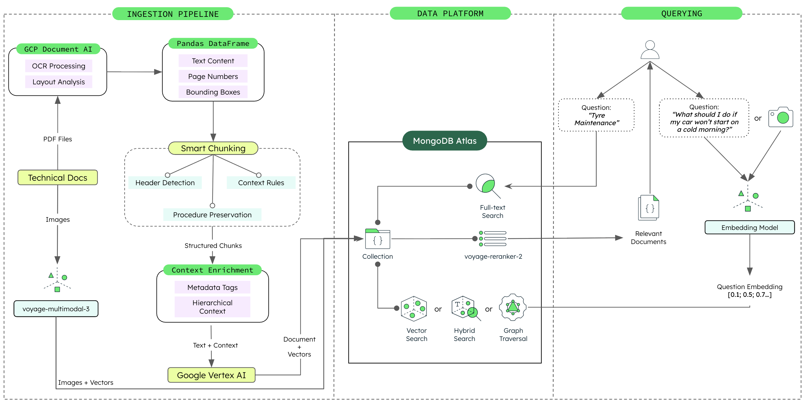

# Car Manual Explorer

## Context-Aware Intelligent Retrieval for Technical Docs


**Intelligent search and retrieval for automotive technical documentation.**

This platform demonstrates MongoDB's Unified Data Platform capabilities, showcasing how flexible JSON document storage enables multiple retrieval pipelines working together: smart chunking, full-text search, vector embeddings, knowledge graphs, multimodal search, and Voyage AI reranking.

By the end of this guide you'll have a comprehensive car manual exploration system up and running, capable of all the solutions mentioned above.

### What This App Does

Car Manual Explorer is an intelligent search and retrieval system designed to help technicians, mechanics, and automotive professionals quickly find relevant information across complex technical documentation. The application solves the common problem of navigating lengthy, multi-section car manuals by providing five distinct retrieval methods, each optimized for different types of queries and use cases.

**Key Capabilities:**

- **Five Retrieval Techniques**: Vector Search (semantic similarity), Text Search (keyword-based), Hybrid Search (combined vector + text), GraphRAG Search (relationship-aware), and Multimodal Search (text + images)
- **Optional AI Reranking**: Voyage AI reranker improves result relevance across all search methods
- **Multimodal Support**: Search both text content and images using natural language queries or image uploads
- **Context-Aware Results**: Preserves hierarchical structure and relationships between document sections

**Value Proposition:**

- Reduces search time by 60-75% compared to manual document navigation
- Improves accuracy with intelligent semantic understanding
- Enables multimodal discovery (find images by describing them in text)
- Provides relationship-aware search through knowledge graph traversal

**Use Cases:**

- Finding specific repair procedures ("How do I change a tire?")
- Troubleshooting issues ("What causes engine overheating?")
- Understanding component relationships ("What systems are related to the brake system?")
- Locating visual references ("Show me the engine diagram")
- Discovering related procedures through graph traversal

We will walk you through the process of configuring and using [MongoDB Atlas](https://www.mongodb.com/atlas) as your backend with [Google Vertex AI](https://cloud.google.com/vertex-ai) for MongoDB-powered search and question answering in your [Next.js](https://nextjs.org/) and [FastAPI](https://fastapi.tiangolo.com/) application.

The architecture we're about to set up is depicted in the diagram below:



**Key Platform Capabilities:**

The application provides five distinct retrieval techniques, each optimized for different query types:

1. **Vector Search**: Semantic similarity using AI embeddings (768-dim vectors) - finds conceptually similar content even without keyword matches
2. **Text Search**: Keyword-based search with fuzzy matching and stemming - advanced compound query structure prioritizes exact phrases, individual words, and handles typos
3. **Hybrid Search**: Combines vector + text using MongoDB's native `$rankFusion` - Reciprocal Rank Fusion (RRF) with intelligent score weighting
4. **GraphRAG Search**: Relationship-aware search using MongoDB's `$graphLookup` for knowledge graph traversal - expands results through document relationships
5. **Multimodal Search**: Text-to-image and image-to-image search using Voyage AI multimodal embeddings (1024-dim) - search images using text queries or find similar images

**Optional Enhancement:**

- **Voyage AI Reranker**: Optional AI-powered reranking that improves result relevance across all search methods using cross-encoder technology (rerank-2.5 model)

**Additional Capabilities:**

- **Unified Data Platform**: MongoDB's flexible JSON document model serves as the foundation for both storage and retrieval
- **Context-Aware Chunking**: Smart document processing that preserves hierarchical structure and relationships

Let's get started!

## Prerequisites

Before you begin working with this project, ensure that you have the following prerequisites set up in your development environment:

- **Python 3.10**: The backend of this project is built with Python 3.10 specifically. You can download it from the [official website](https://www.python.org/downloads/).

- **Node.js 18+**: The frontend requires Node.js 18 or higher, which includes npm for package management. You can download it from the [official Node.js website](https://nodejs.org/).

- **Poetry**: The backend uses Poetry for dependency management. Install it by following the instructions on the [Poetry website](https://python-poetry.org/docs/#installation).

- **MongoDB Atlas Account (8.1+)**: This project uses MongoDB Atlas for data storage, hybrid search capabilities with native $rankFusion, and multimodal search. **MongoDB 8.1 or higher is required** for the $rankFusion aggregation stage. If you don't have an account, you can sign up for free at [MongoDB Atlas](https://www.mongodb.com/cloud/atlas/register). Once you have an account, follow these steps to set up a minimum free tier cluster:

  - Log in to your MongoDB Atlas account.
  - Create a new project or use an existing one, and then click "create a new database".
  - Choose the free tier option (M0).
  - Configure the cluster settings according to your preferences and then click "finish and close" on the bottom right.
  - Finally, add your IP to the network access list so you can access your cluster remotely.

- **Voyage AI API Key**: Required for multimodal embeddings and AI reranking capabilities. Voyage AI provides industry-leading multimodal embeddings and semantic reranking. You can sign up for free at [Voyage AI](https://www.voyageai.com/) and obtain your API key from the dashboard. The free tier includes generous usage limits to get started.

- **Docker (Optional)**: For containerized deployment, Docker is required. Install it from the [Docker website](https://www.docker.com/get-started).

## Initial Configuration

### Obtain your MongoDB Connection String

Once the MongoDB Atlas Cluster is set up, locate your newly created cluster, click the "Connect" button and select the "Connect your application" section. Copy the provided connection string. It should resemble something like this:

```
mongodb+srv://<username>:<password>@cluster-name.xxxxx.mongodb.net/
```

> [!Note]
> You will need the connection string to set up your environment variables later (`MONGODB_URI`).

### Cloning the Github Repository

Now it's time to clone the Car Manual Explorer source code from GitHub to your local machine:

1. Open your terminal or command prompt.

2. Navigate to your preferred directory where you want to store the project using the `cd` command. For example:

   ```bash
   cd /path/to/your/desired/directory
   ```

3. Once you're in the desired directory, use the `git clone` command to clone the repository:

   ```bash
   git clone https://github.com/mongodb-industry-solutions/manufacturing-car-manual-RAG.git
   ```

4. After running the `git clone` command a new directory with the repository's name will be created in your chosen directory. To navigate into the cloned repository, use the `cd` command:

   ```bash
   cd car-manual-explorer
   ```

## MongoDB Atlas Configuration

### Set up Vector Search Index

Car Manual Explorer leverages MongoDB Atlas Vector Search for semantic search capabilities. Follow these steps to enable it:

1. Navigate to your MongoDB Atlas dashboard and select your cluster.

2. Click on the "Search" tab located in the top navigation menu.

3. Click "Create Search Index".

4. Choose the JSON editor and click "Next".

5. Name your index "manual_vector_search_index".

6. Select your database and collection.

7. For the index definition, paste the following JSON:

   ```json
   {
     "fields": [
       {
         "numDimensions": 768,
         "path": "embedding",
         "similarity": "cosine",
         "type": "vector"
       },
       {
         "path": "id",
         "type": "filter"
       },
       {
         "path": "content_type",
         "type": "filter"
       },
       {
         "path": "vehicle_systems",
         "type": "filter"
       },
       {
         "path": "page_numbers",
         "type": "filter"
       }
     ]
   }
   ```

8. Click "Next" and confirm by clicking "Create Search Index".

> [!Note]
> The index name ("manual_vector_search_index") must match exactly for the application to work properly.

### Set up Text Search Index

For keyword-based search functionality:

1. In the Search tab, click "Create Search Index" again.

2. Choose the JSON editor.

3. Name your index "manual_text_search_index".

4. Select the same database and collection.

5. Use the following index definition:

   ```json
   {
     "mappings": {
       "dynamic": true,
       "fields": {
         "text": {
           "type": "string",
           "analyzer": "lucene.standard"
         },
         "heading_level_1": {
           "type": "string",
           "analyzer": "lucene.standard"
         },
         "heading_level_2": {
           "type": "string",
           "analyzer": "lucene.standard"
         }
       }
     }
   }
   ```

6. Create the index.

### Set up Multimodal Vector Search Index

For multimodal image search capabilities, you need to create a separate vector search index specifically for multimodal embeddings:

1. In the Search tab, click "Create Search Index" again.

2. Choose the JSON editor.

3. Name your index "manual_multimodal_vector_index".

4. Select the same database and collection.

5. Use the following index definition:

   ```json
   {
     "fields": [
       {
         "numDimensions": 1024,
         "path": "multimodal_embedding",
         "similarity": "cosine",
         "type": "vector"
       }
     ]
   }
   ```

6. Click "Next" and confirm by clicking "Create Search Index".

> [!Note]
> This multimodal vector index is separate from the text vector index (`manual_vector_search_index`). The multimodal index uses 1024-dimensional embeddings (from Voyage AI's voyage-multimodal-3 model) for image search, while the text vector index uses 768-dimensional embeddings for text semantic search.

## Backend Configuration

### Set up Environment Variables

Navigate to the `backend` directory of your project:

```bash
cd backend
```

Create a `.env` file with the following configuration settings:

```
# MongoDB Connection
MONGODB_URI=mongodb+srv://<username>:<password>@cluster-name.xxxxx.mongodb.net/
DATABASE_NAME=
COLLECTION_NAME=

# For Google Vertex AI
GCP_PROJECT_ID=your-project-id
GCP_LOCATION=us-central1
GOOGLE_APPLICATION_CREDENTIALS=/path/to/service-account-key.json

# Search Configuration
VECTOR_INDEX_NAME=manual_vector_search_index
TEXT_INDEX_NAME=manual_text_search_index
VECTOR_FIELD_NAME=embedding
EMBEDDINGS_MODEL_ID=text-embedding-005

# Voyage AI Configuration
VOYAGE_API_KEY=your_voyage_api_key_here
MULTIMODAL_MODEL_ID=voyage-multimodal-3
MULTIMODAL_VECTOR_INDEX_NAME=manual_multimodal_vector_index
```

Replace the placeholder values with your actual MongoDB URI and other settings.

> [!Note]
> To obtain your Voyage AI API key, sign up at [Voyage AI](https://www.voyageai.com/) and navigate to your dashboard to generate an API key. The free tier includes generous usage limits for getting started with multimodal search and reranking.

> [!Note]
> Never commit your `.env` file to version control. Make sure it's included in your `.gitignore` file.

### Install Dependencies

While in the `backend` directory, install the required dependencies using Poetry:

```bash
poetry install
```

This will create a virtual environment and install all the dependencies specified in the `pyproject.toml` file.

### Data Ingestion using the Car Manual Notebook

This project includes a Jupyter Notebook, `Car Manual Data Ingestion Notebook.ipynb`, to help you process your own car manual PDFs. The notebook guides you through the following steps:

1.  **Parsing**: Using Google's Document AI to parse the PDF and extract text, layout, and hierarchical information.
2.  **Chunking**: Intelligently splitting the extracted content into meaningful, semantically-aware chunks.
3.  **Embedding**: Generating vector embeddings for each chunk using Google's Vertex AI.
4.  **Storing**: Saving the processed data, including text, metadata, and embeddings, into your MongoDB Atlas collection in a format compatible with the web application.

#### Prerequisites for the Notebook

Before running the notebook, you need to have the following:

- A **Google Cloud Platform (GCP) Project**.
- The **Document AI** and **Vertex AI** APIs enabled in your GCP project.
- A service account with appropriate permissions for Document AI and Vertex AI.
- Your car manual in PDF format.

#### Running the Notebook

1.  Open the `Car Manual Data Ingestion Notebook.ipynb` in a Jupyter environment (like Jupyter Lab or Google Colab).
2.  Follow the instructions in the notebook to install the required Python libraries.
3.  Configure your GCP project details and service account credentials as instructed in the notebook.
4.  Set the path to your car manual PDF.
5.  Run the notebook cells sequentially to process the PDF, create embeddings, and ingest the data into MongoDB.

#### Output Data Format

The notebook will generate documents in your MongoDB collection with the following structure, which is ready to be used by the Car Manual Explorer application:

```json
{
  "id": "chunk_0042",
  "text": "To change a flat tire, first ensure the vehicle is safely parked...",
  "breadcrumb_trail": "Roadside Emergencies > Changing a Tire",
  "page_numbers": [145, 146],
  "content_type": ["procedure", "safety"],
  "heading_level_1": "Roadside Emergencies",
  "heading_level_2": "Changing a Tire",
  "vehicle_systems": ["suspension", "brakes"],
  "embedding": [0.12, 0.34, ...] // 768-dimensional vector
}
```

### Image Ingestion

This project includes scripts to ingest images into MongoDB with multimodal embeddings for image search capabilities. Images are stored in MongoDB GridFS and associated documents are created in the same collection as text chunks (unified collection approach).

#### Using the Image Ingestion Script

The `backend/scripts/ingest_images.py` script processes images and creates multimodal embeddings:

1. **Basic Usage** (automatic metadata extraction from filenames):

   ```bash
   cd backend
   poetry run python scripts/ingest_images.py --image-dir /path/to/images
   ```

   The script automatically extracts:

   - Page numbers from filename patterns (e.g., `page_42`, `p85`)
   - Diagram types from keywords (engine, brake, electrical, etc.)

2. **With Metadata Mapping** (for detailed metadata):

   ```bash
   poetry run python scripts/ingest_images.py \
       --image-dir /path/to/images \
       --mapping /path/to/mapping.json
   ```

   See `backend/scripts/image_mapping_template.json` for the mapping format.

3. **Dry Run** (test without database changes):

   ```bash
   poetry run python scripts/ingest_images.py \
       --image-dir /path/to/images \
       --dry-run
   ```

#### Metadata Mapping Format

The mapping JSON file should have this structure:

```json
{
  "filename.jpg": {
    "chunk_ids": ["chunk_00123", "chunk_00124"],
    "page_number": 42,
    "caption": "Description of the image",
    "diagram_type": "mechanical|electrical|diagram|schematic",
    "breadcrumb_trail": "Section > Subsection > Topic"
  }
}
```

#### Custom Image Upload

For more control over image metadata, use the `backend/scripts/upload_custom_images.py` script:

```bash
poetry run python scripts/upload_custom_images.py \
  --image-dir ./my_images \
  --metadata ./metadata.json
```

**Metadata JSON format:**

```json
{
  "control_labels.jpg": {
    "title": "Multi-language Control Labels",
    "description": "Table of control labels in English, Spanish, and French.",
    "keywords": ["labels", "multilingual", "symbols"],
    "languages": ["English", "Spanish", "French"],
    "category": "Labels & Warnings",
    "breadcrumb_trail": "Reference > Labels & Warnings",
    "page_numbers": [15],
    "content_type": ["diagram", "reference"],
    "vehicle_systems": ["safety"],
    "associated_chunk_ids": []
  }
}
```

#### Image Document Structure

Images are stored in the same collection as text chunks with the following structure:

```json
{
  "id": "image_custom_001",
  "text": "Multi-language Control Labels",
  "multimodal_embedding": [0.1, 0.2, ...],  // 1024 dimensions
  "gridfs_file_id": "507f1f77bcf86cd799439011",
  "title": "Multi-language Control Labels",
  "description": "Table of control labels in English, Spanish, and French.",
  "keywords": ["labels", "multilingual", "symbols"],
  "languages": ["English", "Spanish", "French"],
  "category": "Labels & Warnings",
  "page_numbers": [15],
  "breadcrumb_trail": "Reference > Labels & Warnings",
  "content_type": ["diagram", "reference"],
  "vehicle_systems": ["safety"],
  "associated_chunk_ids": ["chunk_00123"]
}
```

**Key Points:**

- Images use `multimodal_embedding` field (1024-dim) while text chunks use `embedding` field (768-dim)
- Images are filtered by field existence: `{multimodal_embedding: {$exists: true}}`
- Images are stored in GridFS, referenced by `gridfs_file_id`
- Both text chunks and images coexist in the same collection (unified approach)

For detailed instructions, see `backend/scripts/README_IMAGE_INGESTION.md`.

### Start the Backend Server

Start the FastAPI backend server with the following command:

```bash
poetry run python main.py
```

Your backend API should now be running at [http://localhost:8000](http://localhost:8000).

Visit [http://localhost:8000/docs](http://localhost:8000/docs) to explore the interactive API documentation.

## Frontend Configuration

### Set up Environment Variables

Navigate to the `frontend` directory of your project:

```bash
cd ../frontend
```

Create a `.env.local` file with the following content:

```
NEXT_PUBLIC_API_BASE_URL=http://localhost:8000/api/v1
```

> [!Note]
> The `.env.local` file will be ignored by Git automatically.

### Install Dependencies

Install the frontend dependencies using npm:

```bash
npm install
```

### Start the Frontend Development Server

Launch the Next.js development server:

```bash
npm run dev
```

Your frontend application should now be running at [http://localhost:3000](http://localhost:3000).

## Using the Application

### Search Interface

The search interface provides five powerful methods to find information in car manuals, demonstrating MongoDB's Unified Data Platform with diverse retrieval pipelines:

1. Navigate to [http://localhost:3000/search](http://localhost:3000/search).

2. Choose your search method:

   - **Vector Search**: Semantic similarity using 768-dimensional embeddings from Google's text-embedding-005 model. Finds conceptually similar content even without keyword matches. Best for natural language queries like "How do I fix a flat tire?"

   - **Text Search**: MongoDB Atlas full-text search with English stemming. Advanced compound query structure with three-phase matching: exact phrases (boost 10/8), individual words (boost 5/4), and fuzzy matching (boost 2/1.5). Field prioritization: breadcrumb_trail > text. Best for finding specific terms, part numbers, or exact phrases.

   - **Hybrid Search**: Combines vector and text search using MongoDB's native $rankFusion aggregation stage. Automatically performs Reciprocal Rank Fusion (RRF) with k=60 constant. Visual percentage breakdown showing vector vs text contributions. Provides the most comprehensive results with intelligent score weighting. Works well with any query type.

   - **GraphRAG Search**: Relationship-aware search using MongoDB's $graphLookup for knowledge graph traversal. Vector→Graph expansion: Finds initial seeds via vector search, then expands through document relationships. Four relationship types: SEQUENTIAL_TO, RELATED_TO, MENTIONS_SYSTEM, IS_OF_TYPE. Configurable traversal depth (1-4 levels). Knowledge graph visualization available. Best for discovering related procedures and understanding component relationships.

   - **Multimodal Search**: Text-to-image and image-to-image search using Voyage AI's voyage-multimodal-3 model (1024-dim embeddings). Text-to-image: Search images using text queries like "engine diagram". Image-to-image: Find similar images by uploading an image. Images stored in MongoDB GridFS with rich metadata (title, description, keywords, languages, category). Can include related text chunks with each image result.

3. Enter your query:

   - Vector Search examples: "How do I fix a flat tire?", "What causes engine overheating?"
   - Text Search examples: "battery replacement", "oil change interval"
   - Hybrid Search: Works well with any query type
   - GraphRAG Search examples: "tire replacement steps", "engine oil maintenance", "brake system components"
   - Multimodal Search: Text queries like "engine diagram" or upload an image for similar image search

4. Review the results:

   - **Hybrid Search**: Shows combined RRF score and visual percentage breakdown of vector vs text contributions
   - **GraphRAG Search**: Displays relationship-based results expanded through document connections
   - **Multimodal Search**: Returns images with similarity scores
   - **Vector/Text Search**: Shows individual search method scores
   - **Score Display**: RRF scores typically range from 0.001 to 0.05 (this is normal and expected)
   - Click "View Details" to see the full content with context navigation
   - Visual indicators show safety notices, procedural steps, and content types

Each search method adapts to different query types and use cases, demonstrating how MongoDB's flexible document model powers multiple retrieval pipelines for optimal accuracy.

#### Voyage AI Reranker (Optional Enhancement)

All five search methods support optional AI-powered reranking to improve result relevance. The reranker uses Voyage AI's rerank-2.5 model, which employs a cross-encoder approach to analyze query-document pairs together for better semantic understanding.

**What is Reranking?**

Reranking is a post-processing step that re-scores and reorders search results after the initial retrieval. Unlike the initial search (which uses bi-encoders that compare pre-computed embeddings), reranking uses cross-encoders that analyze the query and each document together, providing more accurate relevance assessment.

**How to Enable:**

- Toggle the "Voyage AI Reranker" checkbox in the search interface
- Available for all 5 search methods (Vector, Text, Hybrid, GraphRAG, Multimodal)
- Visual indicators show position changes (original position → new position after reranking)

**Benefits:**

- 20-40% improvement in top-result relevance
- Better semantic understanding of query intent
- Moves most relevant documents to the top
- Reduces need to scroll through results

**Performance:**

- Typically 200-500ms for 20-30 documents
- Applied only when enabled via toggle
- Uses Voyage AI's rerank-2.5 model

**Visual Feedback:**

- Reranking metadata shows position changes
- Original position and new position displayed for each result
- Reranker score shown alongside search scores

> [!Note]
> The search interface maintains your search state in the URL, making it easy to share specific searches.

### Browse Chunks

To explore the manual content systematically:

1. Navigate to [http://localhost:3000/browse](http://localhost:3000/browse).

2. Browse through all manual sections with:

   - Hierarchical navigation
   - Content type filtering
   - System category filtering
   - Pagination for large manuals

3. Click any chunk to view:
   - Full text content
   - Safety notices and warnings
   - Procedural steps
   - Related vehicle systems
   - Navigation to previous/next sections

## Docker Deployment

For containerized deployment in production environments:

1. Ensure Docker and Docker Compose are installed on your system.

2. From the root directory of the project, build the images:

   ```bash
   docker-compose build
   ```

3. Start the containers:

   ```bash
   docker-compose up -d
   ```

4. Access the application:
   - Frontend: [http://localhost:3000](http://localhost:3000)
   - Backend API: [http://localhost:8000](http://localhost:8000)
   - API Documentation: [http://localhost:8000/docs](http://localhost:8000/docs)

> [!Note]
> The Docker configuration uses production settings. Check the `docker-compose.yml` file for environment variable configuration.

## Advanced Features

### Search Methods Explained

1. **Vector Search**:

   - Uses 768-dimensional embeddings generated by Google's text-embedding-005 model
   - Finds conceptually similar content even without keyword matches
   - Best for natural language queries and finding related procedures
   - Semantic similarity using cosine distance

2. **Text Search**:

   - MongoDB Atlas full-text search with English stemming
   - Advanced compound query structure with three-phase matching strategy
   - Supports fuzzy matching for typos and variations
   - Boost values prioritize exact phrases (10/8) > individual words (5/4) > fuzzy matches (2/1.5)
   - Field prioritization: breadcrumb_trail > text
   - Best for finding specific terms, part numbers, or exact phrases

3. **Hybrid Search**:

   - Combines vector and text search results using MongoDB's native $rankFusion aggregation stage
   - Automatically performs Reciprocal Rank Fusion (RRF) with k=60 constant
   - Displays combined RRF scores and individual contribution percentages
   - Visual percentage slider showing vector (blue) vs text (green) contributions
   - Provides the most comprehensive results with intelligent score weighting
   - Works well with any query type

4. **GraphRAG Search**:

   - Uses MongoDB's $graphLookup for relationship-aware document traversal
   - Vector→Graph expansion: Finds initial seeds via vector search, then expands through relationships
   - Configurable traversal depth (1-4 levels) for broader context discovery
   - Leverages four relationship types: SEQUENTIAL_TO, RELATED_TO, MENTIONS_SYSTEM, IS_OF_TYPE
   - Knowledge graph visualization available for interactive exploration
   - Best for discovering related procedures and understanding component relationships

5. **Multimodal Search**:
   - Text-to-image: Search images using text queries
   - Image-to-image: Find similar images by uploading an image
   - Uses Voyage AI's voyage-multimodal-3 model (1024-dim embeddings)
   - Images stored in MongoDB GridFS with rich metadata
   - Returns images with title, description, keywords, languages, category
   - Can include related text chunks with each image result

### Enhanced Compound Search Pipeline

The application implements an **advanced compound query structure** that dramatically improves search relevance by distinguishing between exact phrases, individual words, and typos. This is critical for technical documentation where precision matters.

#### Three-Phase Matching Strategy

1. **Exact Phrase Matching** (Boost: 10/8)

   - Finds complete phrases like "check engine light" as a unit
   - Ensures specific procedures rank highest

2. **Individual Word Matching** (Boost: 5/4)

   - Finds documents with all words present (even if separated)
   - Captures related content discussing the topic

3. **Fuzzy Matching** (Boost: 2/1.5)
   - Catches typos and variations ("engin lite")
   - Ensures no relevant content is missed

#### Smart Field Prioritization

The pipeline prioritizes **breadcrumb_trail** over **text** because:

- Section titles contain the most relevant terminology
- Navigation context helps users find specific procedures faster
- Reduces noise from incidental mentions in body text

#### Real-World Impact

For a search like "check engine light":

- Documents with the exact phrase in navigation: ~17 points
- Documents with the phrase in main text: ~13.5 points
- Documents with only individual words: ~9 points
- Documents with typos: ~3.5 points (still visible but ranked lower)

This compound approach ensures the most relevant content always appears first, crucial for technicians who need quick access to specific repair procedures. The same enhanced structure is used in both text search and the text component of hybrid search.

### Voyage AI Reranker Deep Dive

The application includes an optional AI-powered reranking service that can be applied to all five search methods to improve result relevance.

#### How Reranking Works

**Bi-Encoder vs Cross-Encoder:**

- **Bi-Encoder (Initial Search)**: Query and documents are encoded separately, then compared. Fast and efficient (O(n) comparisons), but may miss nuanced relevance because there's no query-document interaction.

- **Cross-Encoder (Reranking)**: Query and each document are analyzed together by the model. More accurate relevance assessment because the model sees the full context of both query and document simultaneously.

#### Technical Implementation

- **Model**: Voyage AI's rerank-2.5
- **Max Documents**: Up to 1,000 per query
- **Max Query Tokens**: 8,000
- **Context Length**: 32,000 tokens
- **Input**: Query + Document pairs
- **Output**: Relevance scores (0-1 range)

**Process Flow:**

1. Take top N results from initial search (typically 20-50 documents)
2. Prepare documents: Combine text, context, and metadata
3. Send query + documents to Voyage AI API
4. Receive relevance scores for each document
5. Reorder results by reranker scores
6. Return reranked list with position tracking metadata

#### When to Use Reranking

- **Recommended for**: Complex queries, ambiguous queries, when initial results don't seem quite right
- **Benefits**: 20-40% improvement in top-result relevance, better semantic understanding
- **Trade-offs**: Adds 200-500ms latency, API costs (~$0.001-0.002 per rerank operation)

#### Position Tracking

The reranker provides detailed metadata including:

- Original position (before reranking)
- New position (after reranking)
- Reranker score
- Position change indicators in the UI

This transparency helps users understand how reranking improved their results.

### Image Storage Architecture

The application uses a unified collection approach where both text chunks and images are stored in the same MongoDB collection (`manuals` or your configured collection name).

**GridFS for Binary Storage:**

- Images are stored in MongoDB GridFS (default bucket: `fs`)
- GridFS automatically handles large files by splitting them into chunks
- Each image document references its GridFS file via `gridfs_file_id`

**Unified Collection Structure:**

- **Text Chunks**: Have `embedding` field (768-dim) for semantic search
- **Image Documents**: Have `multimodal_embedding` field (1024-dim) for image search
- **Natural Filtering**: Images are filtered by field existence: `{multimodal_embedding: {$exists: true}}`
- No document type field needed - field presence determines type

**Image Metadata:**

Images include rich metadata fields:

- `title`: Image title/name
- `description`: Detailed description
- `keywords`: Searchable keywords array
- `languages`: Languages present in image
- `category`: Category/group classification
- `page_numbers`: Associated page numbers
- `breadcrumb_trail`: Navigation context
- `associated_chunk_ids`: Related text chunk IDs

This unified approach simplifies queries and enables seamless integration between text and image search results.

### Content Structure

The application intelligently processes car manuals to preserve:

- **Hierarchical Context**: Maintains section and subsection relationships
- **Procedural Integrity**: Keeps step-by-step instructions together
- **Safety Information**: Highlights warnings and cautions
- **Cross-References**: Links related sections and procedures
- **Visual Elements**: References to diagrams and illustrations

## Troubleshooting

Here are some common issues and their solutions:

- **MongoDB Connection Issues**:

  - Verify your connection string format
  - Ensure your IP address is whitelisted in MongoDB Atlas
  - Check database and collection names match your configuration

- **Vector Search Not Working**:

  - Confirm the vector index is created with the correct name
  - Verify embeddings are being generated (check dimension: 768)
  - Ensure your AI service credentials are valid

- **Text Search Issues**:

  - Check that the text search index exists
  - Verify the index includes the fields you're searching

- **AI Service Errors**:

  - For Google Cloud: Check service account permissions and API enablement
  - Ensure credentials are correctly formatted in `.env`

- **Frontend API Connection**:

  - Verify backend is running on the expected port
  - Check CORS configuration includes your frontend URL
  - Ensure API base URL is correctly set in frontend `.env.local`

- **Multimodal Search Issues**:

  - Verify multimodal vector index exists and is named correctly (`manual_multimodal_vector_index`)
  - Check Voyage API key is valid and has proper permissions
  - Verify image documents have `multimodal_embedding` field (1024 dimensions)
  - Check GridFS files are accessible (verify `gridfs_file_id` references exist)
  - Verify image ingestion completed successfully (check document count)
  - Ensure images were processed with Voyage AI's voyage-multimodal-3 model

- **Voyage AI Reranker Issues**:

  - API key validation errors: Verify `VOYAGE_API_KEY` is set correctly in `.env`
  - Rate limiting issues: Check Voyage AI dashboard for usage limits
  - Model availability: Ensure rerank-2.5 model is available (check Voyage AI status)
  - Query/document length limits: Reranker supports up to 32k tokens total context
  - Performance troubleshooting: Reranking adds 200-500ms latency; consider limiting document count
  - Empty results: Reranker requires non-empty query and results

- **Voyage AI General Errors**:
  - API key not found: Ensure `VOYAGE_API_KEY` is set in backend `.env` file
  - Invalid model ID: Verify `MULTIMODAL_MODEL_ID=voyage-multimodal-3` is correct
  - Network connectivity issues: Check internet connection and Voyage AI service status
  - Embedding generation failures: Verify API key has proper permissions and credits available

## Additional Resources

Check additional and accompanying resources below:

- [MongoDB Atlas Documentation](https://docs.mongodb.com/atlas/)
- [MongoDB Atlas Vector Search](https://www.mongodb.com/docs/atlas/atlas-vector-search/)
- [MongoDB GridFS Documentation](https://www.mongodb.com/docs/manual/core/gridfs/)
- [Google Vertex AI Documentation](https://cloud.google.com/vertex-ai/docs)
- [Voyage AI Documentation](https://docs.voyageai.com/)
- [Voyage AI Signup](https://www.voyageai.com/)
- [MongoDB Leafygreen UI Components](https://www.mongodb.design/)

## License

This project is licensed under the MIT License - see the [LICENSE](LICENSE) file for details.
